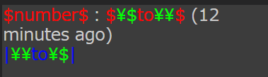
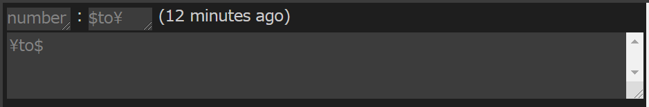

# &gt;&gt;Anyget（仮） ReadMe  
## このツールについて  
[小説家になろう](https://syosetu.com/)等の小説投稿サイトにおける、いわゆる「架空掲示板」ジャンル作品の創作に対する支援ツールです。「架空掲示板」の他にも雛型の連続によって描かれる小説、つまり  
  
- チャットノベル  
- 架空Twitter  
- [ハーメルン](https://syosetu.org/)の特殊タグ多用小説  
  
などの執筆も効率化できます。  
### 「架空掲示板」ジャンルとは？  
その名の通り、「架空の世界における匿名掲示板」を舞台として物語を展開する小説ジャンルです。  
「匿名掲示板」という一般的なファンタジーには中々出てこないような概念が前提となっていることから、どちらかと言えばSFジャンルに多いです。  

### 推奨環境
- Google Chrome
## 用語  
### パネル  
AnygetのUIは、4枚のパネルによって構成されています。デフォルトで真ん中に配置されているパネルが**メインパネル**、その他のパネルが**サブパネル**です。  
パネルはレイアウト上、下記の3つの列に分けられています。  
- サブパネル1枚の列  
- メインパネル1枚の列  
- サブパネル2枚の列  
  
これらの列はメインパネルの「設定」メニューから並び替えが可能です。  
サブパネルの機能は、パネル上部の文字列をクリックしてプルダウンメニューから選択することで変更できます。  
  
## サブパネルの機能  
### テンプレートパネル  
本ツールにおける重要存在である**テンプレート**の設定を行うパネルです。上のテキストボックスにテンプレート用の文字列を入力して「**変更**」ボタンをクリックして下のフォームに反映することで、テンプレートの変更が可能です。  
  
#### テンプレートとは？  
レスの雛形です。例えば簡易的な匿名掲示板のテンプレートなら、  
  
```  
(番号)：(名前)　[(メールアドレス)]  
(本文)  
```  
  
という風に表現できるでしょう。この場合、`()`で囲まれた内容が可変部であることが何となく想像がつくと思います。Anygetではこれを厳密化して、テンプレートの**構文**を定義しています。  
  
#### テンプレートの構文  
テンプレートは基本的に**変数**と**地の文**によって構成されます。変数はレスを入力する際に可変部分としてテキストボックスの形を取り、それに対し地の文は不変部分です。  
変数は**名称**を**特殊記号**で挟むことによって宣言されます。名称はそのまま、ツール内での**変数名**として使用されます。新しい変数を宣言することはできても、既存の変数の名称を変更することは<u>今のところは</u>できません。  
以下に構文の具体的な仕様を記します。  
  
---  
  
* `$`特殊記号……名称を挟むことで**一行変数**を宣言します  
* `|`特殊記号……名称を挟むことで**複数行変数**を宣言します  
* `\`特殊記号……文字の前に挟むことで一切の特殊記号を**エスケープ**可能です。`\`そのものをエスケープしたいときは`\\`とします  
  
---  
  
例えば、このようなテンプレートを設定して「変更」ボタンを押したとします：  
  
```  
$number$：$\$to\\$ (12 minutes ago)  
|\\to\$|  
```  
  
この時、下のボックスのテンプレートは次のように表示され、  
  
    
  
  
メインパネル「レスの追加」モード下部の入力欄は次のように書き換えられます。  
  
    
  
  
#### テンプレートのハイライト  
上の例でも確認できますが、テンプレートパネルの下部には簡易なハイライトの機能が付いています。  
トークンによって色が決められており、具体的には下記のようになっています。  
  
- 一行変数……<span style="color: #FF0000;">#FF0000</span>  
- 複数行変数……<span style="color: #0000FF;">#0000FF</span>  
- エスケープ記号とその対象……<span style="color: #00FF00;">#00FF00</span>  
- 地の文……テーマ依存  
  
#### テンプレートの切り替え  
テンプレートパネル下部の入力欄を操作することで、使用するテンプレートを切り替えることができます。  
テンプレートは一つのセーブファイル内に**複数個**混在させることが可能です。  
  
### 変数の詳細設定パネル  
変数の詳細設定パネルは、テンプレートパネルで宣言した変数について詳細な設定を行うパネルです。上部のリストから変数を選択したうえで下部に入力を行うことで設定が可能です。設定によっては使える変数の種類が限られる場合があります。  
#### 増加幅  
**一行変数限定**  
「レス番」などの変数向けの設定です。「投稿の追加」ボタンを押すたびに、設定された値が入力欄の変数に**加算**されます。マイナスの値を設定すれば減算も可能です。**数字**[^1]にしか加算は行われません。  
#### アンカー  
**一行変数限定**  
チェックボックスをオンにしたうえでテキストボックスに文字列を入力することで**アンカー**を設定できます。  
これは「特定の変数の直前に置くことでリンクを作ったりツールチップを表示したりできる」というもので、メインパネル「プレビュー」モードと簡易プレビューパネル限定で使用できます。  
例えば変数`number`のアンカーに`>>`を設定すればレス番呼び出しが可能になりますし、変数`id`のアンカーに`id:`を設定すれば「id:KW2jqwoi君自演バレバレですよｗ」といったレスを挟んだ際具体的にどんなことをしているか確認できます。  
本文中に10000個以上存在するアンカーは弾かれます。  
#### 固定する  
**両方可**  
設定した変数は、レスの削除や並び替えの影響を受けず、その場に**固定され続け**ます。「ここにレスを挿入したいが、そうするトレス番がずれてしまう」という状況には、レス番に該当する変数を固定することで対処が可能です。  
#### 入力候補  
**現在凍結中**  
  
### ランダム文字列生成パネル  
IDやトリップなどに使用するランダムな文字列を自動生成するツールです。チェックボックスやテキストボックスに設定値を入力したうえで、右下の「生成」ボタンをクリックすることで生成可能です。  
#### 生成に関する設定  
色々あります。  
##### 「A-Z」  
文字列の候補に大文字アルファベット（`ABCDEFGHIJKLMNOPQRSTUVWXYZ`）を追加します。  
##### 「a-z」  
文字列の候補に小文字アルファベット（`abcdefghijklmnopqrstuvwxyz`）を追加します。  
##### 「0-9」  
文字列の候補に数字（`0123456789`）を追加します。  
##### 「記号」  
文字列の候補に半角記号（``!"#$%&'()*+,-./:;<=>?@[\]^_`{|}~``）を追加します。  
  
##### 「半角空白」  
文字列の候補に半角空白（` `）を追加します。  
  
##### 「自由入力」  
チェックを入れた上で**テキストボックスに入力した文字**を文字列の候補に追加します。重複は弾かれます。  
  
##### 「○文字」  
生成する文字列の長さを設定します。入力が無い場合1文字になります。  
##### 「○個」  
生成する文字列の個数を設定します。一つ一つは改行で区切られてテキストボックスに出力されます。入力が無い場合1個になります。  
#### 代入ツール  
ランダム文字列生成ツールで生成した値をそのまま何かしらの変数に**代入**できます。「上から●番目以降の変数■に代入」と言った風に行います。  
代入ツールはテキストボックスから入力値を取ってきてそれを**改行で分割**したうえで一つずつ代入するため、改行交じりの文字列は正常に代入できません。  
  
### 簡易プレビューパネル  
サブパネルに設定することで、編集中の小説を簡易的にプレビューすることが可能です。アンカーも動作します。ただし、アンカーをクリックしても簡易プレビューパネル内の対応メッセージには飛びません。  
基本的にメインパネル「プレビュー」モード（後述）と同じですが、軽量化のため一部アルゴリズムが違います。  
  
## メインパネルの機能  
上部のタブを切り替えることで、メインパネルの**モード**を変更することができます。タブメニュー自体は左右のボタンによってスクロールが可能です。  
### 「レスの追加」モード  
基本的に、ユーザーはこのモードを軸に小説を執筆していくことになります。  
  
#### 基本的構造  
このモードにおいて、編集は名前通り「**レス（投稿）の追加**」という形で行われます。パネルの下部に存在する**入力欄**が選択中のテンプレートに応じて変化するので、そこに投稿の内容を入力したうえで「**投稿を追加**」ボタンをクリックすることでレスの追加が可能です。レスは上部ブロックにボックスという形で追加・反映されます。一つ一つのレスは独立しています。  
また、「投稿を追加」ボタンの横には**個数設定ボックス**が存在し、レスの追加はこの中に入力した数の分だけ行われます。  
  
#### レスそのものの構造  
##### テキストボックス  
前述の一行変数・複数行変数をテンプレートとして解釈して生成される入力欄です。一行変数のテキストボックスは`<div>`要素で囲まれた`<input>`要素であり、複数行変数のテキストボックスは`<textarea>`要素です。  
テキストボックスに入力した文字列が、そのまま掲示板小説の内容になります。  
##### 固定ボタン  
削除/編集したくないレスを**固定**するボタンです。レス自体とそれが持つテキストボックス群はすべて保護され、一切の編集や削除を受け付けなくなります。  
固定ボタンをもう1度押すと、固定は解除されます。  
##### 削除ボタン  
マウスオーバー時に出現します。クリックすることでレスを**削除**できます。  
「削除ボタンを押すとレス番が削除されてしまい、ズレが発生する」という場合は、「固定する」設定を行えばズレが発生しません。  
##### テンプレート入力欄  
マウスオーバー時に出現するプルダウンメニューです。選択入力することで、レスのテンプレートを入力内容を番号として持つ物に変更できます。  
#### その他機能  
##### 並び替え  
レスをドラッグして対象とするレスにドロップすることで、レスを**並び替える**ことが可能です。  
並び替えの例としては、  
  
```  
12345  
```  
  
という順番でレスが並んでいたとして、「1」を「5」にドロップした場合、  
  
```  
23451  
```  
  
となり、「5」を「1」にドロップした場合、  
  
```  
51234  
```  
  
となります。  
「並び替えを行うとレス番が入れ替わってしまい、ズレが発生する」という場合は、「固定する」設定を行えばズレが発生しません。  
  
### 「プレビュー」モード  
執筆した掲示板を閲覧（プレビュー）できます。「レスの追加」モードではレス内の変数は単なる文字列ではなくテキストボックスであることによって若干の違和感がありますが、このモードではすべてが同一の書体で表現されます。  
「アンカー」設定を行うことによってアンカーを追加できます。  
  
### 「プレーンテキスト」モード  
執筆した掲示板をプレーンテキストとしてテキストボックスに表示します。テキストボックスを編集しても元データには影響しません。目安として、テキストボックス内の文字数を数える機能が付いています。  
#### レス間文字列の設定  
レスとレスの間の『区切り文字』を設定する機能です。デフォルトでは`\n`（改行）が入力されており、これを編集することで様々な設定が可能です。例えばこれを`\n\n`にすればより見やすくなるでしょうし、`\n--------------\n`などすれば水平線のようなものを描けるでしょう。  
#### 置換  
「from」欄に対象、「to」欄に結果を入力したうえで「置換」ボタンを押すことでテキストボックス内の文字列を**置換**できます。  
前述のとおりテキストボックスを編集しても元データには影響しないため、あくまでも微調整のためのものとなります。  
`.*`チェックボックスをオンにすれば正規表現で置換できます。  
#### コピー  
テキストボックス内の全文字列をクリップボードにコピーします。  
  
### 「セーブ/ロード」モード  
テキストボックスにタイトルを入力したうえで**セーブボタン**を押すことで`.json`ファイル形式によるセーブが可能です。  
セーブファイルをアップロードして**ロードボタン**を押すことでロードが可能です。  
**テンプレートのみセーブ**ボタンは、編集したレスの内容を閲覧せず、テンプレートの情報のみで保存します。  
レイアウトの情報は今のところ保存されません。  
  
### 「設定」モード  
変数の詳細設定パネルが個々の変数について設定を行うのに対し、このモードでは作品全体について設定します。  
上部に「設定の検索」欄がありますが、まだ機能しません。  
#### 表示  
##### テーマ  
CSS変数による**テーマ**を変更します。現時点でのテーマは、  
- VSCode_Dark  
- VSCode_Light  
- HighDark  
- 5ch  
- futaba  
- Twitter  
- Discord  

の7種類です。  
##### 色を付ける  
シンタックスハイライト**もどき**を有効化します。一行変数と複数行変数のテキストボックスの色が、それぞれテーマで定義されたものに変わります。  
##### パネルの並び替え  
プルダウンメニューから選択した順に、パネルの列を並び替えます。この並び替えはCSSの`order`プロパティの設定によるもので、サブパネルの機能変更のようにDOMを直接的に書き換えるものではありません。  
  
### 「置換する」モード  
掲示板の内容を正規表現を使用して置換できます。  
#### 「変数を選択」部分  
置換対象となる変数にチェックを入れます。『全選択』ボタンで全ての変数がチェックされ、『反転』ボタンで反転されます。  
#### 各種設定部分  
チェックボックスによる設定を行います。設定は基本的に正規表現の各種フラグと結びついており、置換結果に影響します。  
- 「`.`に改行をマッチ」……Javascript正規表現における`s`フラグをオンにします。  
- 「マルチライン」……Javascript正規表現における`m`フラグをオンにします。  
- 「大文字・小文字無視」……Javascript正規表現における`i`フラグをオンにします。  
- 「全置換」……Javascript正規表現における`g`フラグをオンにし、さらにそれぞれのレス内のすべての変数を置換対象にします。  
  
  
### 「datファイル」モード  
作成した架空掲示板を、2ch専用ブラウザ等で開ける`.dat`ファイルにエクスポートするモードです。テキストボックスに**テンプレートパネルと同じ記法で**パラメータを入力した後に「datファイルを生成」ボタンを押すことでダウンロードが始まります。パラメータは以下の通りです。  
  
- **スレッドタイトル**……スレッドのタイトルを指定するパラメータです。省略した場合は「UNKNOWN」になります。ファイル名にも使用されます。このパラメータだけは特殊で、テンプレート記法を**使わず**プレーンテキストとして入力します。  
- **名前**……各投稿の"名前"に相当する部分を指定するパラメータです。トリップの処理機能は付いていません。  
- **メールアドレス**……各投稿の"メールアドレス"に相当する部分を指定するパラメータです。  
- **日付・IDなど**……各投稿の"日付"、"ID"等に相当する部分を指定するパラメータです。  
- **本文**……各投稿の"本文"に相当する部分を指定するパラメータです。唯一、途中で改行を挟んでもそれが無視されないパラメータです。  
  
  
[^1]:より具体的に言えば、`\-?[0-9]+(\.[0-9]+)?`の正規表現にマッチする文字列