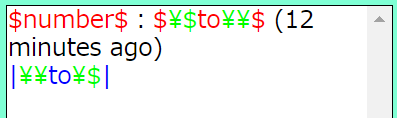
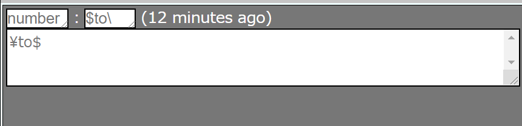

# &gt;&gt;anyget（仮） ReadMe
## このツールについて
[小説家になろう](https://syosetu.com/)等の小説投稿サイトにおける、いわゆる「架空掲示板」ジャンル作品の創作に対する支援ツールです。
### 「架空掲示板」ジャンルとは？
その名の通り、「架空の世界における匿名掲示板」を舞台として物語を展開する小説ジャンルです。
「匿名掲示板」という一般的なファンタジーには中々出てこないような概念が前提となっていることから、どちらかと言えばSFジャンルに多いです。
結構な人気があるジャンルですが、一方支援ツールについてはあまり見られないことから、このツールの制作を決断しました。

## 使い方
### 3つのボックス
anygetのUIは、横に並べられた3つのボックスによって構成されています。左から順に

* **テンプレートボックス**
* **メインボックス**
* **設定ボックス**

です。

### テンプレートボックス
本ツールにおける重要存在である**テンプレート**の設定を行うボックスです。上のテキストボックスにテンプレート用の文字列を入力して「**変更**」ボタンをクリックして下のフォームに反映することで、テンプレートの変更が可能です。

#### テンプレートとは？
レスの雛形です。例えば簡易的な匿名掲示板のテンプレートなら、

```
(番号)：(名前)　[(メールアドレス)]
(本文)
```

という風に表現できるでしょう。この場合、`()`で囲まれた内容が可変部であることが何となく想像がつくと思います。anygetではこれを厳密化して、テンプレートの**構文**を定義しています。

#### テンプレートの構文
テンプレートは基本的に**変数**と**地の文**によって構成されます。変数はレスを入力する際に可変部分としてテキストボックスの形を取り、それに対し地の文は不変部分です。
変数は**名称**を**特殊記号**で挟むことによって宣言されます。名称はそのまま、ツール内での**変数名**として使用されます。新しい変数を宣言することはできても、既存の変数の名称を変更することは<u>今のところは</u>できません。
以下に構文の具体的な仕様を記します。

---

* `$`特殊記号……名称を挟むことで**一行変数**を宣言します
* `|`特殊記号……名称を挟むことで**複数行変数**を宣言します
* `\`特殊記号……文字の前に挟むことで一切の特殊記号を**エスケープ**可能です。`\`そのものをエスケープしたいときは`\\`とします

---

例えば、このようなテンプレートを設定して「変更」ボタンを押したとします：

```
$number$：$\$to\\$ (12 minutes ago)
|\\to\$|
```

この時、下のボックスのテンプレートは下のように表示され、



メインボックス下部の入力欄は下のように書き換えられます。



#### テンプレートのハイライト
上の例でも確認できますが、テンプレートボックスの下部には簡易なシンタックスハイライトの機能が付いています。
変数[^1]によって色が決められており、具体的には下記のようになっています。

* 一行変数……<span style="color: #FF0000;">#FF0000</span>
* 複数行変数……<span style="color: #0000FF;">#0000FF</span>
* エスケープ記号とその対象……<span style="color: #00FF00;">#00FF00</span>[^2]
* 地の文……ブラウザのデフォルトカラー

### メインボックス
メインボックスは**実際に掲示板を編集する**部分です。テンプレートボックスや設定ボックスはあくまでも編集のための前段階として触る物に過ぎず、このツールの文字通りの意味での**メイン**はここなわけです。
#### タブ
メインボックスの上部には ~~3~~ ~~4~~ ~~5~~ **6つ**の**タブ**が存在します。この6つのタブは機能の切り替えのためのもので、選択した**モード**へとメインボックスをシフトさせます。
切り替えの内訳としては『表示方式の変更（編集不能）』が二つ、『外部へのファイル出力』が二つ、『編集』が二つです。
##### 「レスの追加」モード
デフォルトの状態です。6つのモードの中でレスを追加できる[^3]モードは~~この一つだけです~~。レスの**一覧**、そして**入力ボックス**から成ります。詳しくは後述します。
##### 「プレビュー」モード
執筆した掲示板を閲覧（プレビュー）できます。「レスの追加」モードではレス内の変数は単なる文字列ではなくテキストボックスであることによって若干の違和感があるのに対し、このモードでは枠線をそのままに、変数を地の文と同じような外見で表示しています。また、「アンカー」設定（後述）を行うことによってアンカーを追加できます。
##### 「プレーンテキスト」モード
媒体がHTMLのtextarea属性に変わった「プレビュー」モードです。枠線すら存在しなくなり、実際に小説投稿サイトで閲覧する際の状態に最も近いと言えるでしょう。また、文字列のコピーも容易に行えます。
##### 「datファイル」モード
作成した架空掲示板を、5ch専用ブラウザ等で開ける`.dat`ファイルにエクスポートするモードです。テキストボックスに**テンプレートと同じ記法で**パラメータを入力した後に「datファイルを生成」ボタンを押すことでダウンロードが始まります。パラメータは以下の通りです。

* スレッドタイトル……スレッドのタイトルを指定するパラメータです。省略した場合は「UNKNOWN」になります。ファイル名[^4]にも使用されます。このパラメータだけは特殊で、テンプレート記法を**使わず**プレーンテキストとして入力します。
* 名前……各投稿の"名前"に相当する部分を指定するパラメータです。トリップの処理機能は付いていません。
* メールアドレス……各投稿の"メールアドレス"に相当する部分を指定するパラメータです。主な用途はsageです。
* 日付・IDなど……各投稿の"日付"、"ID"等に相当する部分を指定するパラメータです。
* 本文……各投稿の"本文"に相当する部分を指定するパラメータです。唯一、途中で改行を挟んでもそれが無視されないパラメータです。

##### 「セーブ/ロード」モード
"内容を変更する"という意味では、こちらもある意味『編集可能なモード」です。
テキストボックスにタイトルを入力したうえで**セーブボタン**を押すことで`.json`ファイル形式によるセーブが可能です。
セーブしたファイルをアップロードして**ロードボタン**を押すことでロードが可能です。
##### 「置換」モード
掲示板の内容を正規表現を使用して置換できます。
###### 「変数を選択」部分
置換対象となる変数にチェックを入れます。『全選択』ボタンで全ての変数がチェックされ、『反転』ボタンで反転されます。
###### 各種設定部分
チェックボックスによる設定を行います。設定は基本的に正規表現の各種フラグと結びついており、置換結果に影響します。
* 「`.`に改行をマッチ」……Javascript正規表現における`s`フラグをオンにします。
* 「マルチライン」……Javascript正規表現における`m`フラグをオンにします。
* 「大文字・小文字無視」……Javascript正規表現における`i`フラグをオンにします。
* 「全置換」……Javascript正規表現における`g`フラグをオンにします。
#### 「レスの追加」モードの詳細
唯一の編集可能モードであるが故比較的機能が多い事から、項を分けて解説していきます。
##### 基本的な概念
このモードにおいて、編集は名前通り「**レス（投稿）の追加**」という形で行われます。ボックスの下部に存在する**入力欄**がテンプレートに応じて変化するので、そこに投稿の内容を入力したうえで「**投稿を追加**」ボタンをクリックすることでレスの追加が可能です。レスは上部ブロックにボックスという形で追加・反映されます。一つ一つのレスは独立しています。
また、「投稿を追加」ボタンの横には**個数設定ボックス**が存在し、レスの追加はこの中に入力した数の分だけ行われます。
##### レスの構造
レスに存在する部品一つ一つについて、詳細に解説していきます。
###### テキストボックス
前述の一行変数・複数行変数をテンプレートとして解釈して生成される入力欄です。一行変数のテキストボックスは**ワンライナー**であり、複数行変数の物は**テキストエリア**です。
テキストボックスに入力した文字列が、そのまま掲示板小説の内容になります。
ワンライナーのテキストボックスには**入力候補**の表示機能があります。ボックスをクリックすることで、同じ変数の入力履歴から頻出の文字列が候補に選ばれます。候補は最大で5個までで、それ以上は切り捨てられます。
入力候補機能をオフにしたい場合は、「入力候補無効化」設定（後述）を行います。
###### 削除ボタン
レス右上の灰色のボタンで、レスを**削除**します。「真ん中にあるレスを削除してしまうとレス番が飛んでしまう」などと言う場合には、「固定する」設定（後述）を行います。
###### 並び替え機能
"部品"というわけではありませんが、レスはドラッグ&ドロップによる**並び替え**機能も有しています。
レスをドラッグして別のレスに重ねると、重ねられた側のレスが点線で囲まれるので、そこへドロップすることで並び替えが可能です。並び替えは単純に順番を"入れ替える"タイプではなく、ドラッグしたレスをドロップされたレスの直前（または直後[^5]）に"**挿入する**"タイプです。「並び替えるとレス番が飛んでしまう」などと言う場合には、「固定する」設定（後述）を行います。
### 設定ボックス
**「変数の詳細設定」部分**と**ランダム文字列生成ツール**を有するボックスです。
#### 「変数の詳細設定」部分
その時点で宣言されたすべての変数がリストの形で列挙されています。選択したうえで各種パラメータを弄ることで、変数についての詳細な設定を行うことができます。設定一つ一つについて詳細に解説していきます。
##### 「増加幅」設定
「レス番」などの変数向けの設定です。「投稿の追加」ボタンを押すたびに、設定された値が入力欄に**加算**されます。マイナスの値を設定すれば減算も可能です。**数字**[^6]にしか加算は行われません。
##### 「アンカー」設定
~~未実装です。~~ 実装されました。
チェックボックスをオンにしたうえでテキストボックスに文字列を入力することで**アンカー**を設定できます。
これは「特定の変数の直前に置くことでリンクを作ったりプレビューを重ねたりできる」というもので、「プレビュー」モード限定で使用できます。
例えば変数`number`のアンカーに`>>`を設定すればレス番呼び出し[^7]が可能になりますし、変数`id`のアンカーに`id:`を設定すれば所謂「晒し上げ」のような展開を挟んだ際に具体的にどのようなレスが原因となったかを確認する[^8]ことができます。
本文中に4096個以上存在するアンカーは弾かれます。

##### 「固定する」設定
設定した変数は、レスの削除や並び替えの影響を受けず、その場に**固定され続け**ます。「ここにレスを挿入したいが、そうするトレス番がずれてしまう」という状況には、レス番に該当する変数を固定することで対処が可能です。
##### 「入力候補無効化」設定
設定した変数のプルダウンによる入力候補機能は無効化されます。複数行変数にはそもそもプルダウンの機能が無いため、設定を行うことができません。
#### ランダム文字列生成ツール
IDやトリップなどに使用するランダムな文字列を自動生成するツールです。チェックボックスやテキストボックスに設定値を入力したうえで、右下の「生成」ボタンをクリックすることで生成可能です。
##### 生成に関する設定
色々あります。
###### 「A-Z」
文字列の候補に大文字アルファベット（`ABCDEFGHIJKLMNOPQRSTUVWXYZ`）を追加します。
###### 「a-z」
文字列の候補に小文字アルファベット（`abcdefghijklmnopqrstuvwxyz`）を追加します。
###### 「0-9」
文字列の候補に数字（`0123456789`）を追加します。
###### 「記号」
文字列の候補に半角記号（``!"#$%&'()*+,-./:;<=>?@[\]^_`{|}~``）を追加します。

###### 「半角空白」
文字列の候補に半角空白（` `）を追加します。

###### 「自由入力」
チェックを入れた上でテキストボックスに**入力した文字**を文字列の候補に追加します。重複は弾かれます。

###### 「○文字」
生成する文字列の長さを設定します。入力が無い場合1文字になります。
###### 「○個」
生成する文字列の個数を設定します。一つ一つは改行で区切られてテキストボックスに出力されます。入力が無い場合1個になります。
##### 代入ツール
ランダム文字列生成ツールで生成した値をそのまま何かしらの変数に**代入**できます。「上から●番目以降の変数■に代入」と言ったふうに行います。重要なのが**以降**という部分で、代入ツールはテキストボックスから入力値を取ってきてそれを**改行で分割**したうえで一つずつ代入します。そのため、改行交じりの文字列は正常に代入できません。


[^1]:"**文字のモード**と表現した方が正確か
[^2]:他のハイライトより優先されます。
[^3]:イコール、『編集できる』
[^4]:「○○.dat」の○○部分
[^5]:ドラッグするレスの方がドロップされたレスより後に存在するなら直前、前に存在するなら直後
[^6]:より具体的に言えば、`\-?[0-9]+(\.[0-9]+)?`の正規表現にマッチする文字列
[^7]:例：「>>1乙」
[^8]:例：「id:he3J2sdISくん自演おつかれさま＾＾」