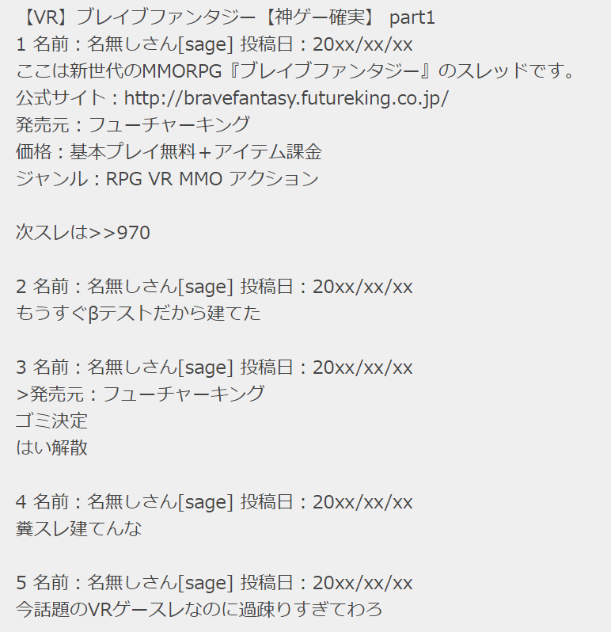
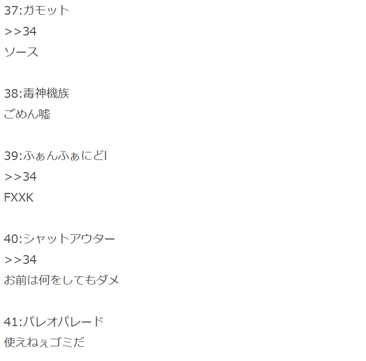
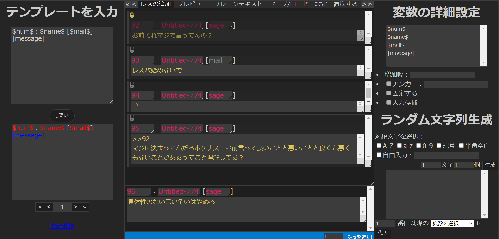

---

marp: true
style: |
    h1, h2, h3, h4, h5, header, footer {
        color: black;
    }
    b {
        color: blue;
    }
    anchor {
        color: blue;
    }
    ind {
        display:block;
        margin-left:60px;
    }
---
# >>Anyget（仮）
掲示板小説執筆支援ツール

---

■ このスレッドは過去ログ倉庫に格納されています

掲示板小説とは？

1 ： <b>名無しさん＠お腹いっぱい。</b>：2021/05/28(金) 18:35 <anchor>&gt;&gt;2</anchor>
<ind>『架空Webサイト小説』の1カテゴリであり、主に<mark>『匿名掲示板』</mark>を専門として扱う小説</ind>

2 ： <b class="age">名無しさん＠お腹いっぱい。</b>：2021/05/28(金) 18:35
<ind><anchor>&gt;&gt;1</anchor>
『匿名掲示板』といっても、殆どの雛型がこのように5ch（https://5ch.net/ ）を踏襲したもの</ind>

3 ： <b>名無しさん＠お腹いっぱい。</b>：2021/05/28(金) 18:36
<ind>VRゲーム〔SF〕ジャンルによく見られる</ind>

4 ： <b>名無しさん＠お腹いっぱい。</b>：2021/05/28(金) 18:37
<ind>詳細はScrapBoxで</ind>

---

■ このスレッドは過去ログ倉庫に格納されています

掲示板小説の分類

1 ： <b>大分類</b>：2021/05/29(土) 10:57 <anchor>&gt;&gt;2 &gt;&gt;3</anchor>
<ind><mark>・全編掲示板</mark></ind>

2 ： <b style="color:green;">大分類</b>：2021/05/29(土) 10:57
<ind><anchor>&gt;&gt;1</anchor>
話の始まりから終わりに至るまで、**すべてを掲示板上で描写する**物語</ind>

3 ： <b>大分類</b>：2021/05/29(土) 10:57 <anchor>&gt;&gt;4</anchor>
<ind><anchor>&gt;&gt;1</anchor>
例：ブレイブファンタジー（https://ncode.syosetu.com/n7778cw/ ）</ind>

４ ： <b>大分類</b>：2021/05/29(土) 10:57
<ind><anchor>&gt;&gt;3</anchor>
できれば読んでください</ind>

---
<!--
_backgroundColor: #ffedbd
-->
### 作品例

    

        <h4 style="font-size:0.65em;margin:0;">『【VR】ブレイブファンタジー【神ゲー確実】』より抜粋</h4>
        
    

    

        <h4 style="font-size:0.65em;margin:0;">『シャングリラ・フロンティア〜クソゲーハンター、神ゲーに挑まんとす〜』より抜粋</h4>
        
    

---

■ このスレッドは過去ログ倉庫に格納されています

掲示板小説の分類

5 ： <b>大分類</b>：2021/05/29(土) 10:59 <anchor>&gt;&gt;6 &gt;&gt;7</anchor>
<ind><mark>・掲示板回</mark></ind>

6 ： <b>大分類</b>：2021/05/29(土) 11:00
<ind><anchor>&gt;&gt;5</anchor>
長編小説、特に非群像劇の<mark>番外編</mark>に見られる形式</ind>

7 ： <b>大分類</b>：2021/05/29(土) 11:00
<ind><anchor>&gt;&gt;5</anchor>
普段主人公に向けられるカメラを第三者が集まる掲示板に向けることで
描写の方向性を変えるなどの効果がある</ind>

8 ： <b style="color:green;">大分類</b>：2021/05/29(土) 11:01
<ind>その他、配信物における**コメント欄**などの『地の文と掲示板が同時並行で存在する』形式もある</ind>

---

■ このスレッドは過去ログ倉庫に格納されています

掲示板小説の分類

9 ： <b style="color:green;">小分類</b>：2021/05/29(土) 12:08
<ind>・雑談スレ</ind>

10 ： <b>小分類</b>：2021/05/29(土) 12:10
<ind>・攻略スレ</ind>

11 ： <b>小分類</b>：2021/05/29(土) 12:10
<ind>・攻略スレのはずがいつの間にか雑談スレになっちゃったスレ</ind>

12 ： <b>小分類</b>：2021/05/29(土) 12:11
<ind>・雑談スレのはずがいつの間にか攻略スレになっちゃったスレ</ind>

13 ： <b style="color:green;">小分類</b>：2021/05/29(土) 12:12
<ind>・釣りスレ</ind>

14 ： <b style="color:green;">小分類</b>：2021/05/29(土) 12:12
<ind>・実況スレ</ind>

15 ： <b>小分類</b>：2021/05/29(土) 12:13
<ind>・ゲーム内掲示板</ind>

---

# 掲示板小説の特長
## キャラを使い捨てられる
- 登場する全キャラクターが匿名であるため、詳細な設定を練らずとも**即興で登場させて即興で退場**させる事が可能
- もちろん、『使い捨てない選択肢』をあえて選び取ることもできる
	- 『ゲーム内掲示板』モデルにおける**プレイヤーネーム**
	- **ID**を付ける
	- **口調**でキャラ付けする

---

# 掲示板小説の特長
## 俯瞰視点での描写ができる
- 基本的に主人公にフォーカスを置く小説に不足しがちな、**主人公が見ていない物**をモブの視点で描写できる
- 活用例：
	- 出し切れなかった設定を消化する
	- 『実況スレ』モデルで主人公の戦いを俯瞰する
	- 複雑な展開を整理して、モブの口を通じて読者に伝える

---

# 掲示板小説の特長
## ツールとの相性がいい
- 本質的に『テンプレートの連続』であるため、適切なツールを使うことで効率的に執筆できる
	- <mark>IDの生成を自動化</mark>するとか
	- <mark>並び替え</mark>に対応するとか
### しかし
- 現状Webに公開されている掲示板小説執筆支援ツールは若干かゆいところに手が届かない物ばかり
	- →だったら、**自分でツールを作ればいい**！！

---

# >>Anyget（仮）
- 強力掲示板小説執筆支援ツール
- **>>2get**というネットスラングから名前（仮）を取った
  

---

# 今ある主な機能

- テンプレート設定
- 変数の固定
- ランダム文字列生成
- 並び替え
- セーブ/ロード
- 置換
- 保護
- 5ch専用ブラウザ向けdatファイルに出力する

---

# 実装を予定している機能

---

### <mark>三項演算子</mark>機能
<h5 style="margin:0;">何</h5>

- 『特定の変数が指定した値をとっている際、
    自分も**影響されて**指定した値をとる』という機能

<h5 style="margin:0;">使いどころ</h5>

- ふたば★ちゃんねる（https://2chan.net ）における**そうだねボタン**の機能
  
<h6 style="margin:0;color:blue;">

　`$そうだね数$`が`""`の場合： 

</h6>

<h6 style="margin:0;color:red;">

　そうでない場合：  

</h6>

……という風に、変数を根拠とした<mark>分岐</mark>に使用する

---

### <mark>メッセージインデント</mark>機能
<h5 style="margin:0;">何</h5>

- メッセージにおける指定した変数を参照することで、
  プレビューなどにおける**インデント**の度合いを決定する機能

<h5 style="margin:0;">使いどころ</h5>

- スラド（https://srad.jp/ ）における言及機能
  はてな匿名ダイアリー（https://anond.hatelabo.jp/ ）におけるトラックバック

  

  

プレビュー時の<mark>再現度</mark>向上に寄与

---

